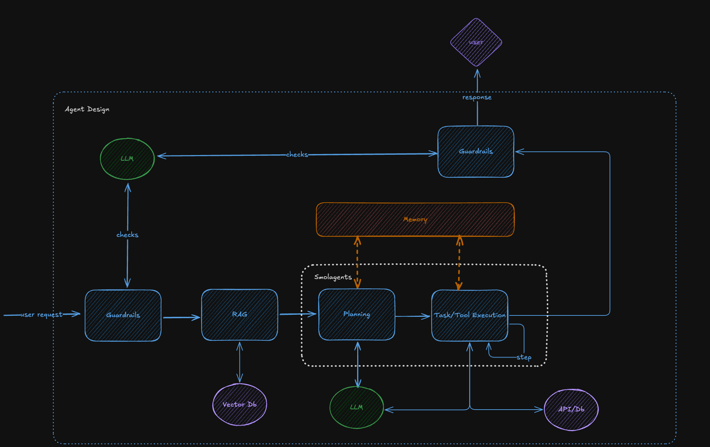
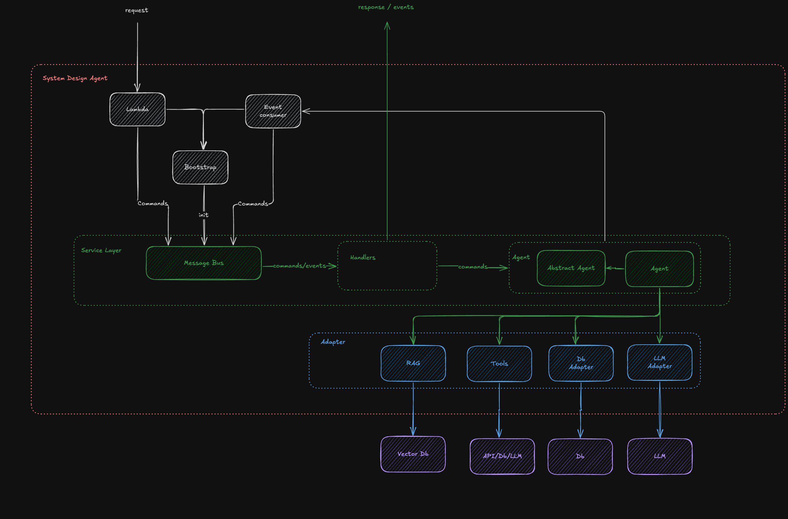

# Agentic AI Framework

An event-driven architecture framework for building agentic AI systems for internal question answering. This framework demonstrates two distinct approaches to building AI agents: Tool-based Agents and LLM Workflows, both leveraging Domain-Driven Design principles from the "Cosmic Python" book.

## Architecture Overview

This framework showcases event-driven architecture patterns for building AI systems with two main approaches:

### 1. Tool Agent Approach
The tool agent uses external tools and APIs to gather information and execute actions. This approach:
- Leverages the `smolagents` library for tool orchestration
- Supports multiple tools for data retrieval, conversion, and analysis
- Uses a planning and execution model with tool selection
- Ideal for tasks requiring real-time data access, calculations, or external system integration

Example use cases:
- Fetching sensor data and creating visualizations
- Querying time-series databases
- Performing calculations on retrieved data
- Integrating with external APIs

### 2. LLM Workflow Approach
The LLM workflow uses a state machine pattern to build SQL queries through multiple stages. This approach:
- Implements a structured pipeline with defined stages (Check → Ground → Filter → Aggregate → Join → Construct → Execute)
- Writes SQL queries based on a decomposition of the question into a series of steps based on the database schema
- Includes guardrails at entry and exit points
- Ideal for knowledge-based Q&A and controlled response generation

Example use cases:
- Answering questions from a knowledge base
- SQL query generation and execution
- Document-based question answering
- Controlled and validated response generation

### Event-Driven Architecture

Both approaches are built on a robust event-driven foundation:
- **Message Bus**: Central command and event handling system
- **Domain Events**: Clear separation of commands and events
- **Dependency Injection**: Clean architecture with swappable adapters
- **Real-time Updates**: WebSocket support for live status updates
- **Observability**: Integrated tracing with Langfuse and OpenTelemetry

## External Dependencies

Both agent approaches rely on external services and APIs to function properly.

To run the external services locally, run the following command:

```
docker compose up
```

from the [Sim Project](https://github.com/SteffenHaeussler/sim_project) root directory.

Repositories for the external services are located in:
- the [Sim Project](https://github.com/SteffenHaeussler/sim_project) repository for generating the data and the database schema
- the [Sim API](https://github.com/SteffenHaeussler/sim_api) repository for the API that provides the tools to the agentic ai framework
- the [Sim RAG](https://github.com/SteffenHaeussler/sim_rag) repository for the RAG that provides the knowledge to the agentic ai framework
- the [Sim Frontend](https://github.com/SteffenHaeussler/sim_frontend) repository for the Frontend that provides the UI for the agentic ai framework

### Required Services

1. **LLM Providers** (for both approaches)
   - Supports multiple LLM providers via `litellm`: Anthropic, OpenAI, Google Gemini
   - Used for reasoning, query generation, and response synthesis
   - Configurable models for different tasks (main LLM, tools LLM, guardrails LLM)

2. **PostgreSQL Database** (for SQL Agent)
   - Required for SQL query execution
   - Stores business data that agents query
   - Connection configured via environment variables

3. **Information Retrieval Services** (for LLM Workflow)
   - Embedding API for document vectorization
   - Ranking API for relevance scoring
   - Retrieval API for semantic search
   - Default endpoints: `http://localhost:5051`

4. **Tool API** (for Tool Agent)
   - External API providing data access tools
   - Sensor data, time-series queries, asset information
   - Default endpoint: `http://localhost:5000`

5. **Observability Services** (optional)
   - Langfuse for LLM tracing and monitoring
   - OpenTelemetry for distributed tracing
   - Configurable via environment variables

### Configuration

All external dependencies are configured through environment variables. See `.env.tests` for configuration templates. Key configurations include:
- API endpoints and credentials
- Database connection strings
- Model selection and parameters
- Service timeouts and limits


### Docker Setup

The framework includes Docker configurations to help set up some of these dependencies locally. Use `make up` to start containerized services.

## Running service manually

To run the service manually in debug mode install the required python dependencies:

`uv install`

You can run the service in dev mode by default:

via fastapi app:
```
make dev
```
and access via [http://127.0.0.1:5055/docs](http://127.0.0.1:5055/docs)

via cli:

### Tool Agent Examples

Run the tool agent for real-time data access and calculations:
```
make run Q="What is the daily maximum value of PI-P0017 in April 2025?" M="tool"
```

### LLM Workflow Examples

Run the LLM workflow for knowledge-based queries:
```
make run Q="How much was produced in the first two weeks of 2025?" M="sql"
```

### More Tool Agent Examples

Tool Agent queries (real-time data, calculations, visualizations):
```
- "What is the daily maximum value of PI-P0017 in April 2025?"
- "Can you compare PI-P0017 and PI-P0016 for the first 10 days in 2025?"
- "What assets are next to asset BA100?"
- "Can you create a plot for the adjacent sensors of asset BA101 for 1st January 2025?"
- "What is the id of TI-T0022?"
- "What is the name of asset id c831fadb-d620-4007-bdda-4593038c87f9?"
- "Can you provide me the highest value for June 2025 for TI-T0022?"
- "What is the current pressure in the distillation?"
- "What is the level in tank b?"
- "Can you plot me the temperature of the distillation cooler A for the last two weeks?"
- "What is the current temperature in the water tank?"
- "Can you plot me data for 18b04353-839d-40a1-84c1-9b547d09dd80 in February?"
```


### More SQL Agent Examples

The SQL agent is a specialized LLM workflow implementation for database queries. It uses a multi-stage pipeline to:
```
- "How many customers do we have?"
- "What are the top 5 selling products?"
- "Show me orders from 2024"
- "What is the average order value?"
```

## Running service in Docker


```
make up
```

and to shut down the service:

```
make down
```

## Testing

To run the tests:

`uv run python -m pytest --verbose --cov=./`

## Evaluation Framework

This framework includes a comprehensive evaluation system to assess the quality and performance of both agent approaches. The evaluation framework uses an LLM judge to score responses across multiple dimensions.

### Evaluation Components

1. **LLM Judge Evaluation**
   - Scores responses on 4 dimensions: accuracy, relevance, completeness, and hallucination
   - Configurable thresholds for pass/fail criteria
   - Provides detailed reasoning for each score
   - Results are stored in JSON format in `evals/reports/`

2. **Evaluation Types**

   **Tool Agent Evaluations:**
   - `make eval_tool_e2e` - End-to-end evaluation of complete tool agent workflow
   - `make eval_tool_enhance` - Tests question enhancement capabilities
   - `make eval_tool_pre_check` - Evaluates input validation and guardrails
   - `make eval_tool_post_check` - Tests output validation
   - `make eval_tool_ir` - Information retrieval evaluation
   - `make eval_tool_tools` - Tool selection and execution evaluation

   **SQL Agent Evaluations:**
   - `make eval_sql_e2e` - End-to-end SQL workflow evaluation
   - `make eval_sql_aggregate` - Tests aggregation query generation
   - `make eval_sql_construct` - SQL query construction evaluation
   - `make eval_sql_filter` - Filter clause generation testing
   - `make eval_sql_grounding` - Entity name to schema mapping
   - `make eval_sql_join` - Join inference evaluation
   - `make eval_sql_pre_check` - Input validation for SQL queries

3. **Running All Evaluations**
   - `make eval_tool` - Run all tool agent evaluations
   - `make eval_sql` - Run all SQL agent evaluations

### Evaluation Reports

Evaluation results are stored in `evals/reports/` with timestamps and include:
- Individual test results with scores
- Pass/fail status based on configured thresholds
- Detailed reasoning from the LLM judge
- Aggregate statistics for the evaluation run

The evaluation framework helps ensure consistent quality across different agent implementations and provides insights into areas for improvement.


## Agent Design




## System Design




## Acknowledgments

This is a personal project inspired by my past work, but built independently from scratch. The architecture is based on Domain-Driven Design principles from the ["Cosmic Python" book](https://www.cosmicpython.com/), demonstrating how event-driven patterns can be effectively applied to AI agent systems.
